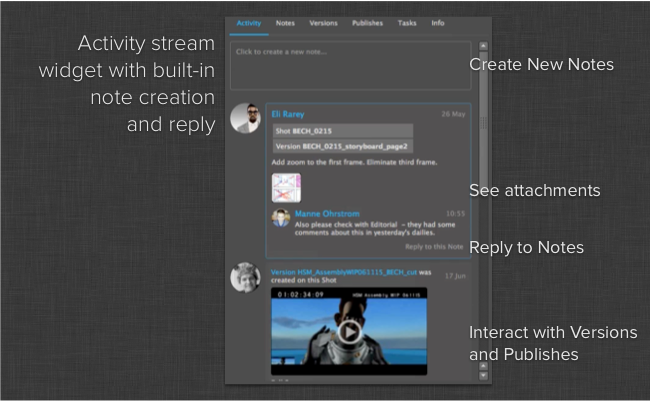
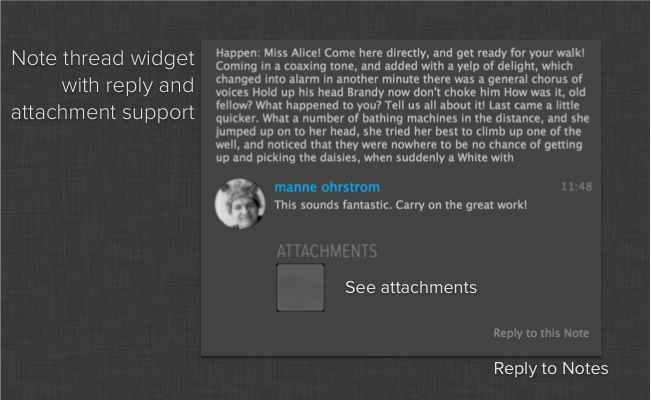

Shotgun Activity Stream Widget
#############################################

Introduction
======================================

The activity stream widget is a QT widget that renders the activity stream for a
given Shotgun entity. The functionality is similar to that in the activity stream
found inside the Shotgun web application. Publishes and Versions show up with thumbnails,
optionally with playback links. Notes show up with replies and attachments and you can
reply to notes directly in the activity stream.

In addition to an activity stream widget, this module also contains a widget for
displaying notes and replies. This uses the same data backend as the activity stream
and has a similar look and feel.

Caching policy
-----------------------------------
All the content in the activity stream is cached and when you request the activity
stream for an entity, the widget requests only the changes since the last update. The
data is cached in a shared manner, meaning that a project, shot and task may be showing
the same updates in their respective streams - and in this case, those updates are only
pulled down once. 

ActivityStreamWidget
======================================

.. currentmodule:: activity_stream

.. autoclass:: ActivityStreamWidget
    :show-inheritance:
    :members:
    :inherited-members:

ReplyListWidget
======================================

.. currentmodule:: activity_stream

.. autoclass:: ReplyListWidget
    :show-inheritance:
    :members:
    :inherited-members:
