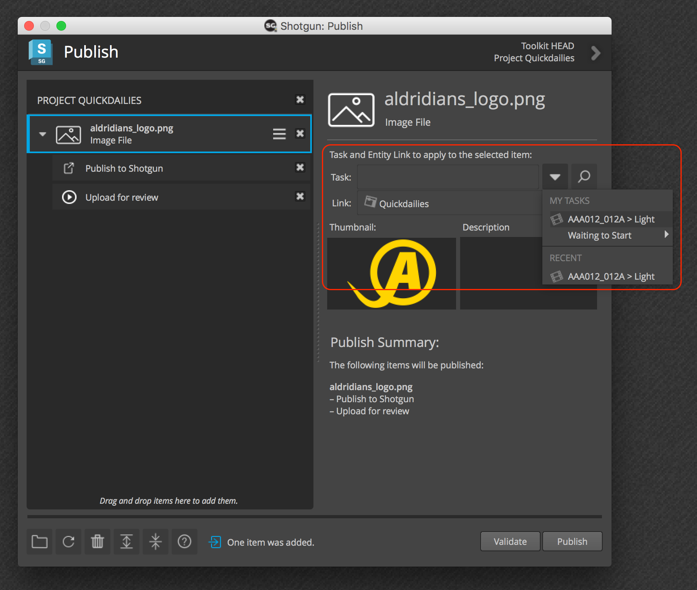

Context Selector Widget
#############################################

.. currentmodule:: context_selector

This widget is a standardized context selection UI, suitable to be
dropped in when a Toolkit App needs a user to select a context:

The widget includes the following features:

- Uses standard auto completers to allow a user to quickly find tasks or links.
- Keeps recently selected tasks on the menu for quick lookup.
- Shows related tasks for a given task or link.
- Configurable to be just a viewer rather than a selector.
- Configurable title

.. autoclass:: ContextWidget
    :members:
    :inherited-members:
    :exclude-members: eventFilter

