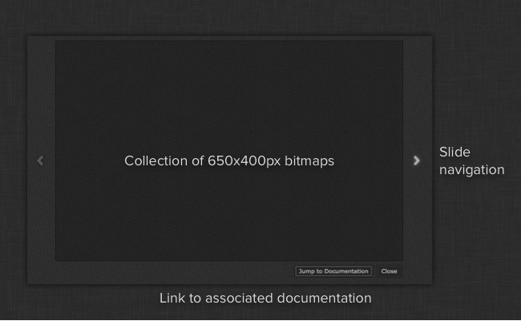

Help Screen Popup
######################################

Introduction
======================================

The help popup is a window which presents a series of help images to the user,
typically displayed at startup, to help introduce new feature or a new application
to a user. The information is presented as an interactive slide show where the user
can easily navigate between sides.

You simply provide it with a list of transparent bitmaps sized 650x400 and it will
create a slideshow with animated transitions and a link to the bundle's associated
documentation (retrieved from the manifest).

Sample Code
---------------------------------------

The ``help_screen`` module contains a single method that takes care of everything.
Simply create the number of 650x400 images that you want and export them as transparent
``png`` files and ensure that the background is transparent (this is not a strict requirement,
but it will most likely look strange with a non-transparent background). Add the
images to the QT resource section of your app and then execute the following code
to launch the help screen::

    # example of how the help screen can be used within your app code

    # import the module - note that this is using the special
    # import_framework code so it won't work outside an app
    help_screen = sgtk.platform.import_framework("tk-framework-qtwidgets", "help_screen")

    # generate pixmaps of the help screen resources we want to display
    help_pix = [ QtGui.QPixmap(":/res/help_1.png"),
                 QtGui.QPixmap(":/res/help_2.png"),
                 QtGui.QPixmap(":/res/help_3.png"),
                 QtGui.QPixmap(":/res/help_4.png") ]

    # get the current app object
    app = sgtk.platform.current_bundle()

    # get the current QT UI window
    window = current_dialog_object.window()

    # and present the help screen. This is a non-blocking call
    # and the application flow will continue
    help_screen.show_help_screen(self.window(), app, help_pix)

API Reference
======================================

.. currentmodule:: help_screen

.. autofunction:: show_help_screen
