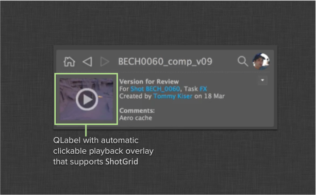

Shotgun Playback Label Widget
#############################################

The Shotgun Playback Label is a simple ``QLabel`` override which
makes it easy to indicate that a thumbnail can be played back:

The widget takes care of analyzing provided shotgun data, and in
case the Shotgun data contains playable media, the playback icon will
automatically appear. Clicking the playback icon will launch a
playback action, currently launching Shotgun screening room in a web browser.

.. note:: In order to use this widget in QT designer, you need to wrap
    the import in a module. For more information on how to do this, see :ref:`widgets-in-designer`.

Use the label like this::

    playback_label = sgtk.platform.import_framework("tk-framework-qtwidgets", "playback_label")

    # construct label object
    label =  playback_label.ShotgunPlaybackLabel(parent_widget)

    # always use label with a pixmap
    label.setPixmap(some_pixmap_object)

    # pass a shotgun data dictionary to tell the label what data we are
    # operating on. Make sure to include relevant fields - for example,
    # if you are passing version data, make sure to include media fields
    label.set_shotgun_data(sg_data)

    # we can check if an icon is displayed
    print "Playback icon displayed: %s" % label.playbable

    # and we can hook it up to other things
    label.playback_clicked.connect(some_callback)

.. currentmodule:: playback_label

.. autoclass:: ShotgunPlaybackLabel
    :show-inheritance:
    :members: set_shotgun_data, playable
