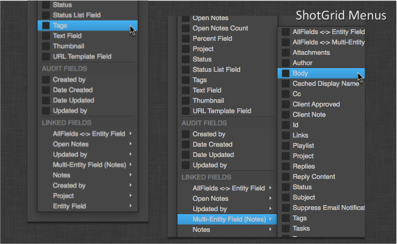

Shotgun Menus
#############

Introduction
============

The Shotgun Menus class provide a standardized interface, look and feel for
building menus that interact with Shotgun.

----

Shotgun Menu
------------

.. currentmodule:: shotgun_menus

.. autoclass:: ShotgunMenu
    :show-inheritance:
    :members:

----

Entity Field Menu
-----------------

.. autoclass:: EntityFieldMenu
    :show-inheritance:
    :members:

