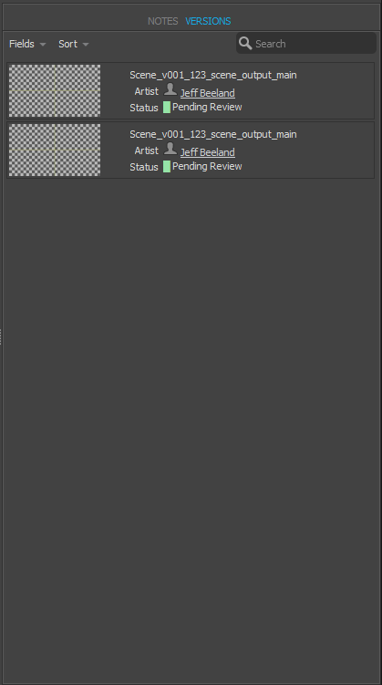

Shotgun Version Details Widget
#############################################

Introduction
======================================

The version details widget is a Qt widget that renders the activity stream of a
Version entity in one tab, and provides a list of related Version entities in
another. A detailed view of of the Version entity, plus its associated fields,
is provided, with the ability for a user to customize what fields they see.

.. image:: images/version_details_notes.png

Caching policy
-----------------------------------
As with the Shotgun Activity Stream Widget, all the content in the Notes tab is cached,
and the widget requests only the changes since the last update.

VersionDetailsWidget
======================================

.. currentmodule:: version_details

.. autoclass:: VersionDetailsWidget
    :show-inheritance:
    :members:
    :inherited-members:
