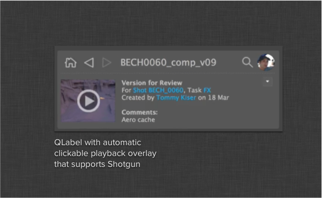

Shotgun Version Playback Widget
#############################################

The version label is a simple ``QLabel`` override which
makes it easy to indicate that a thumbnail can be played back:

The widget takes care of analyzing provided shotgun data, and in
case the data contains playable media, the playback icon will
automatically appear.

.. currentmodule:: version_label

.. autoclass:: VersionLabel
    :show-inheritance:
    :members: set_shotgun_data
