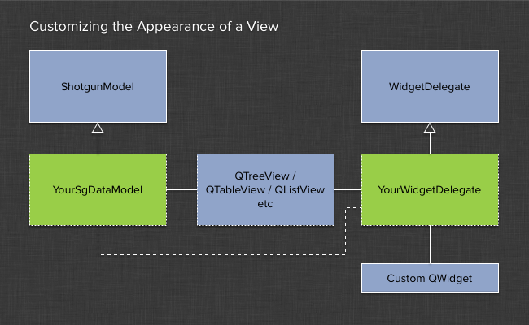

View Related Classes
######################################

This module contains various classes related to QT's MVC model with a focus
on the view side of the data hierarchy.

QT Widget Delegate System
==============================================

The widget delegates module makes it easy to create custom UI experiences that are
using data from the Shotgun Model.

If you feel that the visuals that you get back from a standard
:class:`~PySide.QtGui.QTreeView` or :class:`~PySide.QtGui.QListView` are not sufficient for your needs,
these view utilities provide a collection of tools to help you quickly build
consistent and nice looking user QT Views. These are typically used in conjunction
with the :class:`~tk-framework-shotgunutils:shotgun_model.ShotgunModel` but this is not a requirement.

The widget delegate helper classes makes it easy to connect a ``QWidget`` of
your choosing with a QT View. The classes will use your specified
widget as a brush to paint the view is drawn and updated. This allows for full control
of the visual appearance of any view, yet retaining the higher performance
you get in the QT MVC compared to an approach where large widget hierarchies are built up.

QT allows for customization of cell contents inside of its standard view classes through the use of so called
*delegate* classes (see http://qt-project.org/doc/qt-4.8/model-view-programming.html#delegate-classes),
however this can be cumbersome and difficult to get right. In an attempt to simplify the process of
view customization, the Shotgun Qt Widgets framework contains classes for making it easy to plugin in standard QT widgets
and use these as "brushes" when QT is drawing its views. You can then quickly produce UI in for example the QT designer,
hook up the data exchange between your model class and the widget in a delegate and quickly have some nice custom
looking user interfaces!

The principle is that you derive a custom delegate class from the ``WidgetDelegate`` that is contained in the framework.
This class contains for simple methods that you need to implement. As part of this you can also control the flow of
data from the model into the widget each time it is being drawn, allowing for complex data to be easily passed from
Shotgun via the model into your widget.

The following example shows some of the basic around using this delegate class with the Shotgun Model::

    # import the shotgun_model and view modules from the corresponding frameworks
    shotgun_model = tank.platform.import_framework("tk-framework-shotgunutils", "shotgun_model")
    shotgun_view = tank.platform.import_framework("tk-framework-qtwidgets", "views")

    class ExampleDelegate(shotgun_view.WidgetDelegate):

        def __init__(self, view):
            """
            Constructor
            """
            shotgun_view.WidgetDelegate.__init__(self, view)

        def _create_widget(self, parent):
            """
            Returns the widget to be used when drawing items
            """
            # in this example, we use a simple QLabel to illustrate the principle.
            # for more complex setups, you typically design a more complex widget
            # and use this factory method to create it.
            return QLabel(parent)

        def _on_before_paint(self, widget, model_index, style_options):
            """
            Called when a cell is about to be painted.
            """
            # now we need to prepare our QLabel 'paintbrush' by setting
            # some of the data members. The data is being provided from
            # the underlying model via a model index pointer.

            # note that the widget passed in is typically being reused
            # across multiple cells in order to avoid creating lots of
            # widget objects.

            # get the shotgun query data for this model item
            sg_item = shotgun_model.get_sg_data(model_index)

            # get the description
            desc_str = sg_item.get("description")

            # populate the QLabel with the description data
            widget.setText(desc_str)

            # QLabel is now ready to be used to paint this object on the screen

        def _on_before_selection(self, widget, model_index, style_options):
            """
            Called when a cell is being selected.
            """
            # the widget object passed in here will not be used as a
            # paintbrush but is a proper "live" object. This means
            # that you can have buttons and other objects that a user
            # can interact with as part of the widget. For items that
            # are not selected, these buttons will merely be 'drawn'
            # so they cannot for example exhibit any on-hover behavior.

            # for selected objects however, the widget is live and
            # can be interacted with. Therefore, the widget object
            # in to this method is unique and will not be reused
            # in other places.

            # do std drawing first
            self._on_before_paint(widget, model_index, style_options)

            # at this point, we can indicate that the widget is
            # selected, for example by setting the style
            widget.setStyleSheet("{background-color: red;}")

        def sizeHint(self, style_options, model_index):
            """
            Base the size on the icon size property of the view
            """
            # hint to the delegate system how much space our widget needs
            QtCore.QSize(200, 100)

WidgetDelegate
------------------------------------------

.. currentmodule:: views

.. autoclass:: WidgetDelegate
    :show-inheritance:
    :members:
    :private-members: _get_painter_widget, _create_editor_widget, _on_before_paint, _create_widget
    :exclude-members: createEditor, updateEditorGeometry, paint

EditSelectedWidgetDelegate
------------------------------------------

.. autoclass:: EditSelectedWidgetDelegate
    :show-inheritance:
    :members:
    :inherited-members:
    :private-members: _on_before_selection
    :exclude-members: createEditor, paint, updateEditorGeometry

Grouped List View
==========================================

The grouped list view offers a visual representation where items are grouped into
collapsible sections.

The grouped list view uses the :class:`WidgetDelegate` system in order to render
the UI. A custom QT view - :class:`GroupedListView` - is the main component. The view
expects a tree-like model structure with two levels, a grouping level and a data level.

When the data is loaded in, it will use a special delegate to render the grouping level
of the tree structure. You can customize this delegate easily by providing your own widget.
This widget needs to be able to react to expansion signals sent from the model so that it
can change its appearance when the view decides to expand and contract the section.

The grouping delegate is typically designed as a header-like object. It shouldn't *contain*
any of its child items but rather act as a *partition* between groups. The collapse/expanded
state can for example be indicated by an arrow that is either pointing down or sideways. The
main view logic will take care of hiding any child objects.

If you want to create your own appearance, you can follow these rough steps:

- First, design a grouping widget and make sure it derives from :class:`GroupWidgetBase`.

- Make sure it implements the :meth:`GroupWidgetBase.set_expanded()` for handling its expanded state
  and :meth:`GroupWidgetBase.set_item()` to receive data from the model about what text to display etc.

- Now, derive from the :class:`GroupedListViewItemDelegate` class and implement the factory method
  :meth:`GroupedListViewItemDelegate.create_group_widget()` to return your custom grouping widget.

- If you want the child items to be rendered via custom widget delegates, you can modify your
  derived class at this point to do that too.

- Lastly, pass your delegate to the view via the standard QT
  :meth:`PySide.QtGui.QAbstractItemView.setItemDelegate()` call to bind it to the view.

GroupedListView
------------------------------------------

.. autoclass:: GroupedListView
    :show-inheritance:
    :members:
    :exclude-members: dataChanged, rowsInserted, rowsAboutToBeRemoved, visualRect, isIndexHidden, scrollTo, indexAt, moveCursor, horizontalOffset, verticalOffset, scrollContentsBy, setSelection, visualRegionForSelection, paintEvent, updateGeometries, setModel, edit, itemDelegate

GroupedListViewItemDelegate
------------------------------------------

.. autoclass:: GroupedListViewItemDelegate
    :show-inheritance:
    :members: create_group_widget

GroupWidgetBase
------------------------------------------

.. autoclass:: GroupWidgetBase
    :show-inheritance:
    :members:
    :inherited-members:
